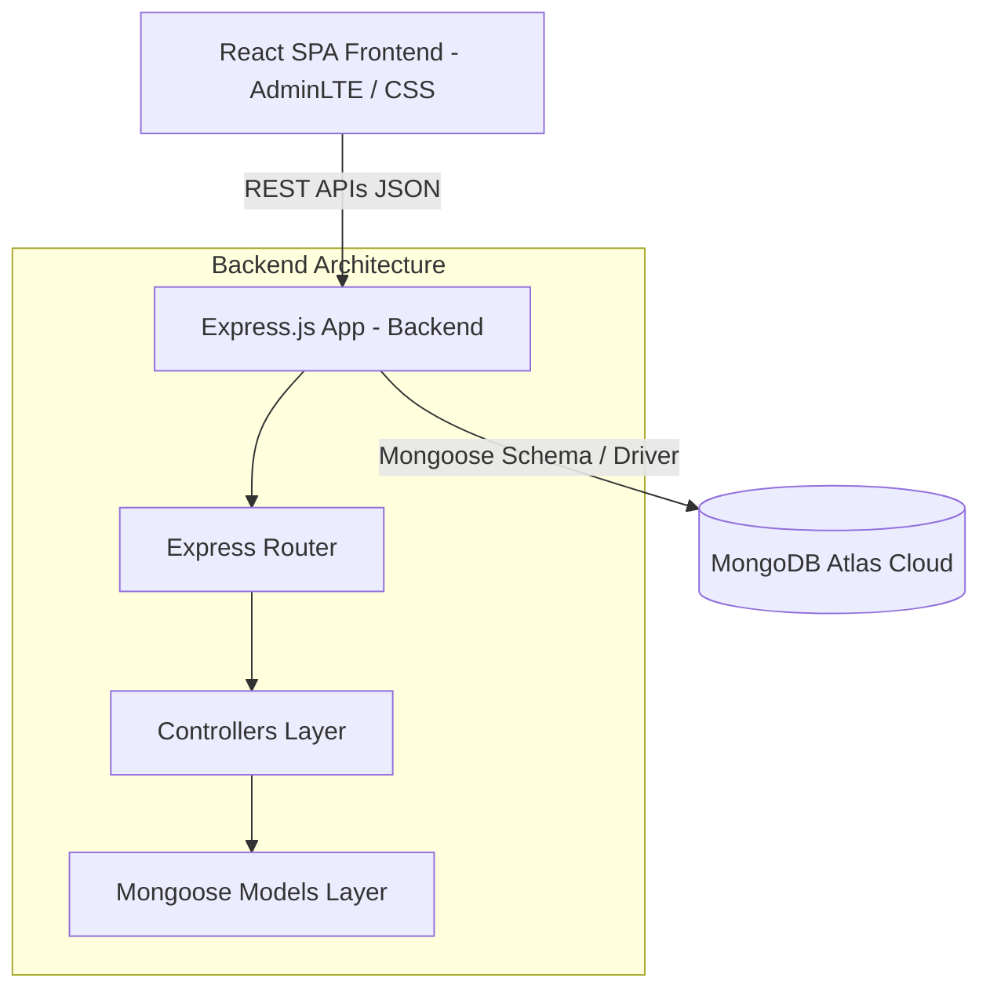

# Tu Doctor Online 🩺

[](https://nodejs.org/)
[](https://expressjs.com/)
[](https://reactjs.org/)
[](https://www.mongodb.com/)
[](https://opensource.org/licenses/MIT)

Una plataforma médica web interactiva que centraliza la interacción entre pacientes y especialistas médicos, facilitando el registro de usuarios, la clasificación de especialidades médicas y el agendamiento automatizado de citas.

---

## 📌 Problem Statement

En los sistemas tradicionales de atención médica, la fragmentación de la información y la fricción en el agendamiento generan cuellos de botella críticos: los pacientes pierden tiempo buscando especialistas disponibles y los centros médicos sufren de ausentismo o subutilización de su personal. 

**Tu Doctor Online** resuelve este problema unificando:
1. Un directorio dinámico y categorizado de especialistas.
2. Un registro autogestionado de pacientes.
3. Un motor central de reserva y agendamiento de citas médicas.

El diseño busca simplificar la experiencia del paciente final mediante una interfaz limpia y estructurada, respaldada por un motor de base de datos no relacional de alta velocidad y consistencia lógica.

---

## ✨ Features (Características Clave)

### 👥 Gestión de Pacientes
- Registro autónomo de nuevos pacientes mediante hashing y almacenamiento seguro.
- Directorio de control administrativo para consultar, actualizar y dar de baja perfiles clínicos.

### 🩺 Directorio de Especialistas y Categorías
- Clasificación de profesionales médicos mediante categorías especializadas (Pediatría, Cardiología, etc.).
- Búsqueda y asignación de especialistas por identificador único.

### 📅 Agendamiento de Citas Médicas
- Motor de reserva que relaciona dinámicamente un paciente (`Patient`), un especialista (`Specialist`) y un bloque temporal (`Date/Time`).
- Validación y control de citas programadas en tiempo real.

---

## 🏛️ Architecture Overview (Vista General de Arquitectura)

El proyecto está diseñado bajo un patrón de **Monorepo Desacoplado** que divide de forma limpia las responsabilidades del cliente y del servidor:



### Decisiones Clave de Arquitectura:
- **Separación de Capas (MVC simplificado en Backend)**: Las rutas delegan directamente en controladores asíncronos (`control/`), los cuales interactúan con la base de datos a través de modelos definidos en Mongoose (`model/`). Esto garantiza que la lógica de transporte HTTP no se mezcle con las reglas de datos.
- **Relaciones Referenciales en MongoDB**: A pesar de ser una base de datos NoSQL, se aprovechan las referencias por `ObjectId` en el modelo de `specialist` (enlazando a su categoría) y en `medical_appointment` (enlazando a un paciente y a un especialista), logrando un modelo relacional eficiente pero flexible en memoria.
- **Seguridad CORS Selectiva**: Se implementa un middleware CORS dinámico que restringe las peticiones entrantes a un conjunto controlado de orígenes autorizados (Whitelist), mitigando ataques de Cross-Origin y protegiendo el endpoint del backend.

---

## 🛠️ Tech Stack (Tecnologías Utilizadas)

### Backend
- **Core Runtime**: Node.js
- **Framework Web**: Express.js
- **ORM / ODM**: Mongoose (MongoDB Object Modeling)
- **Seguridad**: CORS (Cross-Origin Resource Sharing)
- **Entorno**: dotenv (Gestión de variables de entorno seguras)

### Frontend
- **Framework**: React.js (React 18 SPA)
- **Enrutamiento**: React Router DOM v6
- **Plantilla & Estilo**: AdminLTE v3.2 (Bootstrap 4)
- **Notificaciones**: SweetAlert (Flujos UX interactivos)

### Infraestructura y Base de Datos
- **Motor de DB**: MongoDB Atlas (Cloud NoSQL DB)

---

## 📂 Project Structure (Estructura de Carpetas)

```bash
tudoctoronline/
├── backend/                  # Servidor de API REST en Node.js
│   ├── config/               # Configuración e inicialización de servicios (MongoDB)
│   ├── control/              # Controladores (Lógica de negocio y manejo de peticiones)
│   ├── model/                # Esquemas y Modelos de Mongoose (Datos persistentes)
│   ├── var.env               # Variables de entorno locales (Excluido de git en producción)
│   ├── server.js             # Punto de entrada de la aplicación Express
│   └── package.json          # Dependencias y scripts de backend
│
└── frontend/
    └── tu-doctor-online/     # Cliente Single Page Application en React
        ├── public/           # Archivos estáticos HTML y recursos
        ├── src/
        │   ├── assets/       # Imágenes, hojas de estilo adicionales y recursos estáticos
        │   ├── components/   # Componentes globales de UI (Navbar, Sidebar, Footer)
        │   ├── pages/        # Vistas de la aplicación (Auth, Dashboard, Listados)
        │   ├── utils/        # Funciones auxiliares e integraciones de red
        │   ├── App.js        # Configuración de Rutas del cliente (React Router)
        │   ├── index.js      # Punto de entrada de React
        │   └── config.js     # Configuración del entorno del cliente (API Base URL)
```

---

## 🚀 Getting Started (Puesta en Marcha)

### Requisitos Previos
- **Node.js** (versión 16.x o superior)
- **NPM** (incluido con Node)
- Una instancia de **MongoDB** (Local o en la nube mediante MongoDB Atlas)

---

### 1. Configuración del Backend

1. Navega al directorio del backend:
   ```bash
   cd backend
   ```
2. Instala las dependencias necesarias:
   ```bash
   npm install
   ```
3. Configura las variables de entorno en el archivo `var.env` en la raíz de la carpeta `backend`:
   ```env
   PORT=4000
   URI_MONGODB=mongodb+srv://<usuario>:<password>@<cluster>.mongodb.net/DoctorOnline?retryWrites=true&w=majority
   ```
4. Levanta el servidor en modo desarrollo (utiliza `nodemon` para reinicios automáticos):
   ```bash
   npm start
   ```
   El servidor estará disponible en `http://localhost:4000`.

---

### 2. Configuración del Frontend

1. Navega al proyecto frontend:
   ```bash
   cd ../frontend/tu-doctor-online
   ```
2. Instala las dependencias del cliente React:
   ```bash
   npm install
   ```
3. Inicia el servidor de desarrollo:
   ```bash
   npm start
   ```
   La aplicación abrirá tu navegador automáticamente en `http://localhost:3000`.

---

## ⚙️ Quality & Engineering Practices

### Gestión Estricta de CORS
El servidor backend restringe el consumo de su API a través de una función delegada de CORS. Solo los clientes listados en la whitelist tienen permitido realizar peticiones complejas a los recursos de pacientes, especialistas y categorías:
```javascript
var whitelist = ['http://localhost:4000/', 'http://localhost:4200/', 'http://localhost:3000/'];
```

### Arquitectura de Control de Errores asíncrona
Todos los métodos controladores se encuentran encapsulados en bloques `try/catch` asíncronos que garantizan el correcto envío de estados HTTP (`500 Internal Server Error`, `404 Not Found`) y evitan la caída intempestiva del servidor web ante fallos en la capa de datos.

### Buenas prácticas UX en el Frontend
Para evitar recargas innecesarias y dar feedback interactivo al usuario, se utiliza `SweetAlert` al realizar operaciones de mutación de datos (creación, edición y borrado), asegurando una experiencia de SPA pulida y fluida.

---

## 🛣️ Roadmap Técnico

- [ ] **Migración a TypeScript (Full Stack)**: Incorporar tipado estricto tanto en los controladores de Express como en las props/componentes de React.
- [ ] **Autenticación mediante JWT (JSON Web Tokens)**: Reemplazar el flujo actual por sesiones basadas en tokens firmados con roles (Paciente / Especialista / Administrador).
- [ ] **Dockerización Completa**: Generar un archivo `docker-compose.yml` para levantar la base de datos local de MongoDB, el backend y el frontend con un solo comando.
- [ ] **Tests Unitarios e Integración**: Configurar Jest y Supertest en el Backend para pruebas automatizadas de endpoints.

---

## 📝 Lessons Learned (Lecciones Aprendidas)

- **Desacoplamiento Efectivo**: Mantener el backend separado del frontend permite realizar cambios ágiles de estilo o de framework del lado del cliente sin comprometer la estabilidad ni las reglas del servidor API.
- **Modelado No Relacional Referenciado**: Las referencias de Mongoose (`mongoose.Types.ObjectId`) demuestran que las bases de datos NoSQL como MongoDB pueden soportar lógicas relacionales fuertes de manera eficiente si se modelan correctamente mediante arreglos y referencias directas.

---
